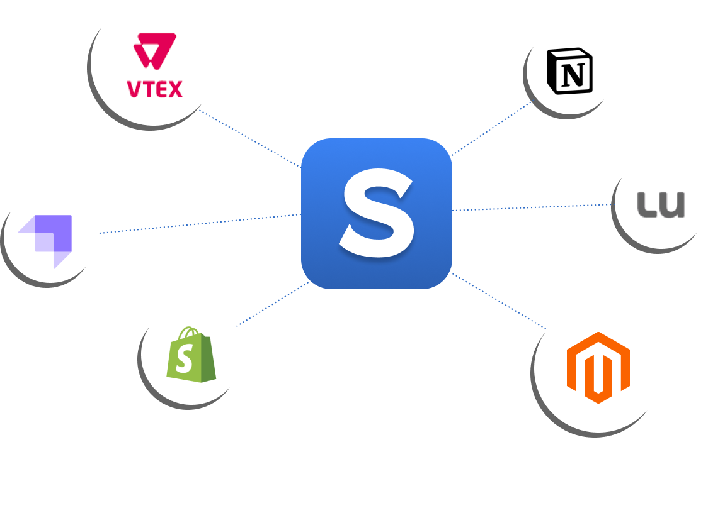

# Scribo Dev

**Much more than a static page builder**

With a drag n' drop interface, Scribo provides a dozen of powerful components that will help you create beautiful and dynamic web apps. These are not just simple HTML elements, we provide, for example, components that can fetch data from external APIs and animation blocks that will make your pages stand out from the crowd

**Design + Development in the same place**

Unlike other no-code builders, Scribo does not limit developers and designers. When necessary, we provide all the tools that developers need to create complex state management, and all the style flexibility that designers need to create beautiful apps

**Headless integration**

Scribo can integrate with many Headless services, from CMS to e-commerce platforms. More than that you can connect to any API or GraphQL and create really dynamic apps