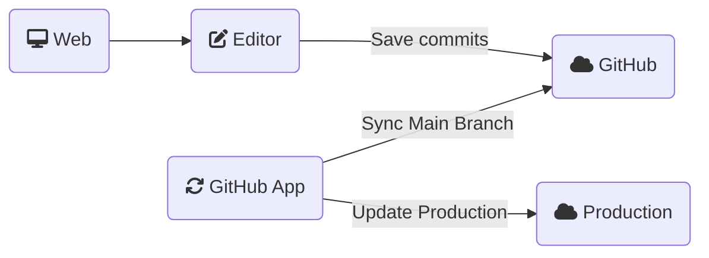

# GitHub Sync

Scribo's platform already provides a simple versioning strategy:

- The one you are currently editing in the Editor could be called as a "development" version
- A "production" version that you can create by clicking on the `Publish` button.

But when working on a big team, you usually need a more powerful versioning control strategy to review future changes before going into production and manage the work on multiple new features or bug fixes. 

Scribo provides a **GitHub Sync** integration for this type of work where you can link your team to a specific GitHub repository. In this mode, you will not be able to "Publish" your changes from the Editor. **Every change to the main branch, will automatically be deployed to your team's production app**. This process is made by our [GitHub App](https://github.com/apps/scribo-dev-sync) that acts like a Continuous Deployment (CD) tool

## Setup

1. The first step is to install our [GitHub App](https://github.com/apps/scribo-dev-sync) and ensure that it has access to the repository in which you would like to sync your team's information.
2. Head back to your team's page editor at Scribo
3. At the left sidebar, you will find a GitHub icon. After clicking on it, you will see a new section where you will select a GitHub repository to store and version your team's page and components information. **Important**: If your repository doesn't show in the Combobox, make sure you did step 1
4. If you choose to sync the repository, the platform will perform the following actions:
    - Save your current work in a file called `theme.json` in the `main` branch of the repository
    - The GitHub App will sync the `main` branch with Scribo
5. Every future change will now be stored in the selected GitHub repository

## Working with branches

After finishing the setup, the GitHub tab in the Editor will now show the branch you are working on and an option to create a new branch. Go ahead and give it a name and create a new branch.

**Important**, every new branch is created based on the `main` branch work.

After making any change, clicking on the Save button will now open a Commit Dialog, where you will need to enter a message. After doing it, the file `theme.json` will be updated on the current branch at GitHub.

To preview those changes, you can click on the preview button at the top right of the Editor. You will be redirected to a URL with the following format:

`https://app.scribo.dev/$TEAM/version/$BRANCH`

This URL can be shared with your team members.

If you validated your changes, you could create a Pull Request to the `main` branch, review it and merge the changes. Remember, every change committed to the `main` branch will be automatically synced and pushed to your team's production app.
