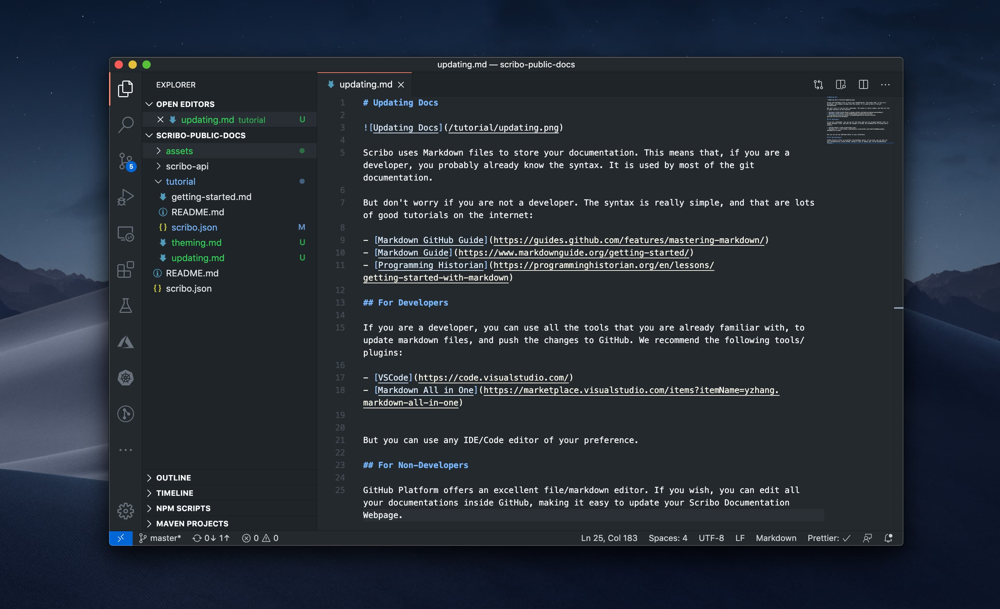
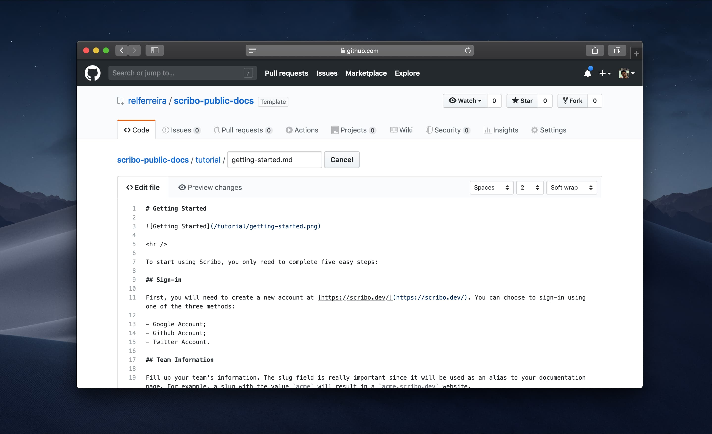

# Updating Docs

Scribo uses Markdown files to store your documentation. This means that, if you are a developer, you probably already know the syntax. It is used by most of the git documentation.

But don't worry if you are not a developer. The syntax is really simple, and that are lots of good tutorials on the internet:

- [Markdown GitHub Guide](https://guides.github.com/features/mastering-markdown/)
- [Markdown Guide](https://www.markdownguide.org/getting-started/)
- [Programming Historian](https://programminghistorian.org/en/lessons/getting-started-with-markdown)

## For Developers

If you are a developer, you can use all the tools that you are already familiar with, to update markdown files, and push the changes to GitHub. We recommend the following tools/plugins:

- [VSCode](https://code.visualstudio.com/)
- [Markdown All in One](https://marketplace.visualstudio.com/items?itemName=yzhang.markdown-all-in-one)

But you can use any IDE/Code editor of your preference.

## For Non-Developers

GitHub Platform offers an excellent file/markdown editor. If you wish, you can edit all your documentations inside GitHub, making it easy to update your Scribo Documentation Webpage.

## Sync

All documentations are static generated. That means that your website will be extremally fast. One downside is that we use many cache techniques, so even if our GitHub app has synced with your commit, please wait at least 5 minutes.

If you are having trouble with the sync process, please contact us!