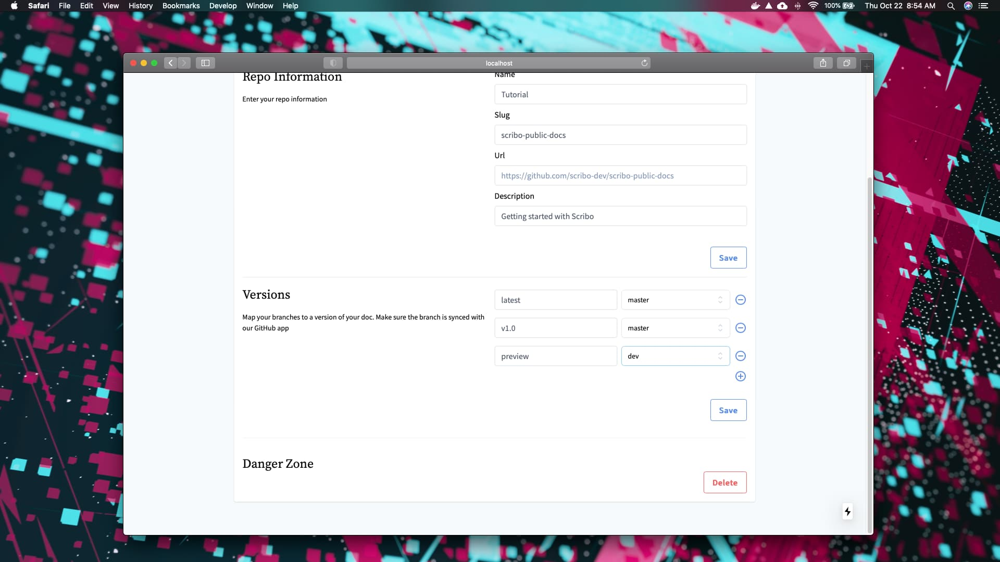
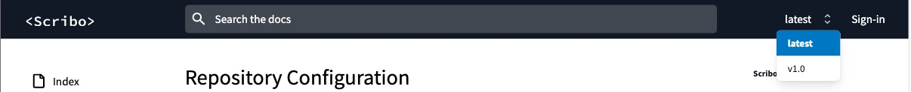

# Versioning

You can manage multiple versions of your documentation by associating a branch to a given version name in our dashboard repository page.

Every documentation has to have at least a version named `latest`. Besides that, you can manage the versions name as you wish. We recommend that you create a `preview` version associated with the branch `dev` so you can review your changes before submitting to the `latest`.

If your doc has more than one version, a select box will be shown in the header, like the one bellow:

